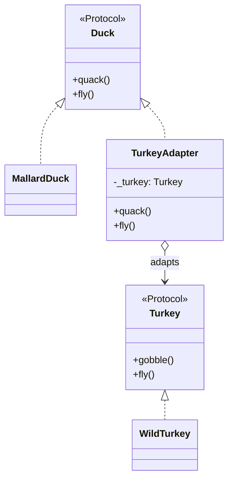

# 适配器模式（Adapter）示例：Duck & Turkey（Python）

> 对应示例文件：`duck_turkey_adapter.py`

## 1. 模式原理

### 1.1 意图（Intent）
将一个类的接口转换成客户端期望的另一个接口，使原本因接口不兼容而无法协作的类可以一起工作。

一句话：**不改旧类，靠“转接层”接入新系统。**

### 1.2 适用场景
当你满足以下任一情况时，适合使用适配器模式：

- 已有类功能可用，但接口与当前系统不兼容。
- 你不希望修改旧代码（第三方库、遗留系统、稳定模块）。
- 希望复用既有实现，而不是重写一套新实现。

### 1.3 关键参与者
- **Target（目标接口）**：`Duck`
- **Adaptee（被适配者）**：`Turkey` / `WildTurkey`
- **Adapter（适配器）**：`TurkeyAdapter`
- **Client（客户端）**：`test_duck`、`main`

### 1.4 与教材 / GoF 描述对照
- GoF 关注点：Adapter 实现 Target 接口，并在内部持有 Adaptee，把客户端请求转换后委托给 Adaptee。
- 本示例中：
  - 客户端只认识 `Duck`（`quack()` + `fly()`）；
  - `TurkeyAdapter` 内部持有 `Turkey`；
  - `quack()` 转发为 `gobble()`，`fly()` 通过多次短距离飞行模拟鸭子的飞行。

### 1.5 Mermaid 简易类图



---

## 2. 示例故事与代码映射

### 2.1 示例故事
现有客户端流程只接受 `Duck`。现在你有一只 `WildTurkey`，不想改客户端，也不想改火鸡类本身，于是增加 `TurkeyAdapter` 进行接口转换。

### 2.2 一一对应关系

| 业务概念 | 代码元素 | 说明 |
|---|---|---|
| 客户端期望接口 | `Duck` | 客户端调用 `quack()` / `fly()` |
| 已有但不兼容对象 | `WildTurkey` | 提供 `gobble()` / `fly()` |
| 转接层 | `TurkeyAdapter` | 实现 Duck 接口，内部委托 Turkey |
| 客户端调用入口 | `test_duck(d: Duck)` | 不关心对象真实类型 |
| 集成演示 | `main()` | 对比原生 Duck、Turkey、Adapter 输出 |

### 2.3 运行时调用主线
1. 客户端函数 `test_duck` 只接收 `Duck`。
2. 将 `WildTurkey` 包装成 `TurkeyAdapter`（视为 Duck）。
3. 客户端调用 `quack()`，适配器转为 `gobble()`。
4. 客户端调用 `fly()`，适配器转为多次短距离 `turkey.fly()`。

---

## 3. 运行说明

### 3.1 目录结构

```text
python-adapter/
└─ duck_turkey_adapter.py
```

### 3.2 依赖与版本
- **Python**：建议 `3.10+`
- **第三方库**：无（仅标准库 `typing`）
- **JDK**：N/A（本仓库为 Python 示例）

### 3.3 运行命令
在 `python-adapter/` 目录下执行：

```bash
python3 duck_turkey_adapter.py
```

Windows（若 `python3` 不可用）可使用：

```bash
python duck_turkey_adapter.py
```

### 3.4 预期输出（示例）

```text
The Turkey says...
Gobble gobble
I'm flying a short distance

The Duck says...
Quack
I'm flying

The TurkeyAdapter says...
Gobble gobble
I'm flying a short distance
I'm flying a short distance
I'm flying a short distance
I'm flying a short distance
I'm flying a short distance
```

---

## 4. 运行截图 + 图注

> 请将你的终端运行截图保存到：`./docs/run-output.png`


**图 1 图注：**
`test_duck` 只按 `Duck` 接口编程，但传入 `TurkeyAdapter` 后依然可工作；输出中的 `Gobble gobble` 与 5 次短距离飞行，说明了**接口已被成功适配而无需修改客户端**。
